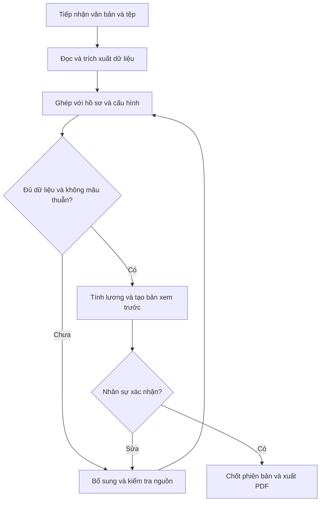

# Kế hoạch xây dựng ứng dụng tạo hợp đồng lao động cho 4 cơ sở trường

Ngày lập 19 tháng 9 năm 2026

## 1 Mục tiêu và quyết định thiết kế

Xây dựng một website riêng bằng tiếng Việt để nhân sự nhập nội dung, thả ảnh hoặc tải tài liệu, kiểm tra nhanh thông tin đã điền và tải một file PDF gồm hợp đồng lao động, phụ lục lương và thỏa thuận trách nhiệm theo mẫu Word đang dùng. Có thể truy cập bằng máy tính và điện thoại. Tài khoản nhân sự được cấp quyền quản lý cả 4 cơ sở.

Mẫu Word của người dùng là nguồn cho bố cục và điều khoản. Hệ thống chỉ điền dữ liệu và chọn các đoạn điều kiện đã được duyệt. AI hỗ trợ đọc tài liệu, phân loại và đề xuất giá trị; các phép tính, điều khoản, lựa chọn người ký và việc phát hành do chương trình xử lý theo cấu hình đã xác nhận.

“Một trường đầu vào” là một vùng tiếp nhận trên giao diện. Phía sau vẫn phải có dữ liệu có cấu trúc. Một ảnh căn cước chỉ cung cấp được một phần thông tin. Muốn xuất nhanh, phải cấu hình sẵn thông tin cơ sở, bên sử dụng lao động, mẫu hợp đồng, chức danh và chính sách lương; những gì chưa có sẽ hiện thành các ô cần bổ sung.

Đây là bản đặc tả để triển khai website. Đã nhận và đọc hai Word thực tế: một file hợp đồng có phụ lục lương, một file thỏa thuận trách nhiệm. Đã chuẩn bị phần lõi thử nghiệm từ JSON sang PDF, cấu hình 4 đơn vị và bản đồ 51 biến tại 89 vị trí. Website, OCR, tài khoản và chức năng phát hành chính thức chưa được triển khai; công thức và điều khoản còn cần được chốt như phần cập nhật 23 và 24.

Phạm vi thực tế đang làm là hợp đồng lao động, phụ lục lương và thỏa thuận trách nhiệm theo mẫu giáo viên của Đại Dương Xanh. Các đơn vị được cung cấp là Vườn Sáng Tạo, Victoria, Gấu Panda và Đại Dương Xanh. Phạm vi áp dụng cho Victoria và các chức danh khác giáo viên cần xác nhận; không chỉ thay tên rồi mặc định mọi điều khoản giáo viên đều phù hợp.

## 2 Trải nghiệm sử dụng hàng ngày

Sau khi cấu hình lần đầu, thao tác thông thường gồm:

1. Chọn cơ sở, hoặc kiểm tra cơ sở đã được ứng dụng ghi nhớ.
2. Dán thông tin, nhập mã nhân viên, thả một hay nhiều ảnh/tệp của cùng người.
3. Xem thông tin trích xuất, chỉ bổ sung chỗ thiếu và xử lý chỗ mâu thuẫn.
4. Chọn vị trí để lấy lương cơ bản; chọn Gross hoặc Net và nhập mức thỏa thuận. Tự nhập Ngày ký / Ngày hiệu lực hợp đồng, rồi kiểm tra bộ tài liệu.
5. Bấm **Xác nhận và tải PDF**; mở file để in ký.

Một người làm nhân sự có thể tự thực hiện toàn bộ các bước theo quyền được cấp. Không cần thêm người phê duyệt trung gian trong bản đầu nếu quy trình của trường không yêu cầu.

Ví dụ nội dung nhập, chỉ dùng minh họa:

> Cơ sở 2. Nguyễn Thị A, giáo viên. Bắt đầu 01/10/2026, hợp đồng 12 tháng. Lương theo công việc 8.000.000 đồng/tháng, phụ cấp trách nhiệm cố định 500.000 đồng/tháng. Thông tin căn cước theo hai ảnh đính kèm.

Chương trình phải làm rõ “lương” là khoản nào nếu người dùng chỉ ghi “lương 8 triệu”; không tự coi đó là lương theo công việc, tổng thu nhập, lương đóng bảo hiểm hay lương thực nhận. Ngày kết thúc được đề xuất theo quy tắc thời hạn đã cấu hình và hiện rõ để xác nhận.

Nếu chỉ nhập mã nhân viên đã có, chương trình lấy hồ sơ còn phù hợp và hỏi các điều kiện mới của lần ký. Không tự tái sử dụng mức lương hoặc loại hợp đồng cũ mà không hiển thị.

## 3 Giao diện nên xây dựng

Màn hình chính ưu tiên tác vụ tạo hợp đồng, không cần biểu đồ hoặc một bảng điều khiển nhiều thông tin.

| Khu vực | Nội dung và hành vi |
| --- | --- |
| Thanh trên | Cơ sở đang thao tác, bên đứng tên hợp đồng, tài khoản |
| Vùng nhập lớn | Gõ hoặc dán văn bản, thả tệp, chọn ảnh, chụp ảnh trên điện thoại |
| Thông tin đã nhận | Người lao động, công việc, thời hạn, lương; chỉnh trực tiếp được |
| Mục cần kiểm tra | Chỉ hiện chỗ thiếu, dữ liệu không khớp, giá trị cần xác nhận |
| Xem trước | PDF hợp đồng và phụ lục; khi chọn một trường có thể xem tài liệu nguồn |
| Thanh thao tác | Lưu nháp, tạo lại xem trước, xác nhận và tải PDF |

Các màn hình phụ gồm Hồ sơ nhân viên, Hợp đồng và phụ lục, Mẫu Word, Cơ sở và đơn vị ký, Chính sách lương, Tài khoản. Các phần cấu hình chỉ dành cho người có quyền.

Màu sắc và thông báo phục vụ việc kiểm tra: “Đã xác nhận”, “Cần kiểm tra”, “Còn thiếu”. Không chỉ dựa vào màu để báo lỗi. Thông báo dùng từ dễ hiểu, ví dụ “Chưa nhập ngày ký / ngày hiệu lực hợp đồng”, không hiện lỗi kỹ thuật hoặc cấu trúc JSON cho nhân sự.

Trên điện thoại, xem thông tin và PDF theo hai tab để tránh chia màn hình quá nhỏ. Có thể bổ sung biểu tượng mở nhanh trên màn hình chính sau. Bản đầu cần mạng khi tạo hợp đồng; không lưu ngầm căn cước và tiền lương vào bộ nhớ ngoại tuyến của trình duyệt.

## 4 Cấu hình lần đầu cho 4 cơ sở

### Phân biệt cơ sở làm việc và bên đứng tên ký

Theo yêu cầu, quản lý 4 hồ sơ đơn vị tách biệt về mẫu, dữ liệu, người ký và số hợp đồng. Trong tên đã cung cấp có 3 chi nhánh; cấu hình giữ riêng loại đơn vị, tên công ty chủ quản và căn cứ ký. Việc quản lý 4 hồ sơ riêng không tự xác nhận chúng là 4 pháp nhân độc lập.

| Đối tượng | Dữ liệu lưu |
| --- | --- |
| Đơn vị sử dụng lao động | Tên pháp lý, địa chỉ, mã định danh hoặc mã số thuế phù hợp, loại đơn vị |
| Cơ sở làm việc | Mã, tên, địa chỉ, đơn vị quản lý, thời gian hiệu lực của quan hệ này |
| Người ký | Họ tên, chức danh, đơn vị, căn cứ thẩm quyền hoặc ủy quyền nếu áp dụng, thời hạn |
| Bộ mẫu | Mẫu hợp đồng, mẫu phụ lục lương, loại lao động, cơ sở áp dụng, phiên bản |
| Hồ sơ chức danh | Tên công việc, nội dung việc làm, địa điểm, thời giờ làm việc, điều kiện mặc định |
| Chính sách lương | Khoản lương, phụ cấp, tham số, công thức, quy tắc làm tròn, thời gian áp dụng |
| Cách đánh số | Phạm vi đơn vị hoặc cơ sở, loại văn bản, năm, số thứ tự, tiền tố |

Mỗi cơ sở cần một bản cấu hình có thể kiểm tra. Không viết bốn nhánh điều kiện cố định trong code theo tên trường. Thêm cơ sở mới bằng cấu hình dữ liệu.

Người làm ở nhiều cơ sở của cùng đơn vị có thể có nhiều địa điểm làm việc. Nếu làm cho các đơn vị độc lập, quản lý quan hệ lao động riêng; không tự gộp hợp đồng hoặc chia sẻ hồ sơ giữa các đơn vị chỉ vì trùng tên hay số căn cước.

### Hồ sơ chức danh giúp giảm nhập liệu

Đã có năm lựa chọn vị trí do người dùng cung cấp: Hiệu trưởng 7.000.000 đồng; Giáo viên mầm non, Giáo viên Tiếng Anh, Bảo mẫu và Tuyển sinh Marketing cùng 5.310.000 đồng. Tên vị trí ánh xạ tới mức lương trong cấu hình, không đọc từ chuỗi tự do rồi đoán. Các vị trí ngoài danh sách cần được cấu hình trước. Mô tả công việc, lịch làm việc và phạm vi điều khoản vẫn có thể khác nhau theo vị trí.

## 5 Định dạng đầu vào

| Định dạng | Cách xử lý | Phạm vi |
| --- | --- | --- |
| Văn bản gõ hoặc dán | Nhận dạng nhãn, số, ngày; dùng AI chuẩn hóa nếu cần | Bản đầu |
| Mã nhân viên | Tìm trong phạm vi hồ sơ được cấp quyền | Bản đầu |
| JPG PNG WebP | Đọc chữ bằng OCR; lưu vị trí nguồn | Bản đầu |
| PDF có chữ | Lấy lớp chữ trước; kiểm tra chất lượng | Bản đầu |
| PDF scan hoặc PDF hỗn hợp | OCR các trang thiếu lớp chữ phù hợp | Bản đầu |
| DOCX chứa thông tin nhân viên | Đọc đoạn và bảng, trích xuất như tài liệu nguồn | Bản đầu |
| XLSX CSV danh sách | Ánh xạ cột và tách từng người | Giai đoạn sau |
| HEIC TIFF DOC cũ | Thêm bộ chuyển đổi và kiểm thử trước khi công bố hỗ trợ | Giai đoạn sau |
| Ảnh chữ viết tay | Thử đọc, yêu cầu kiểm tra kỹ hoặc nhập lại phần không rõ | Mức hỗ trợ có giới hạn |
| Video âm thanh đường dẫn bất kỳ | Chưa nhận trong bản đầu | Ngoài phạm vi ban đầu |

Không hứa đọc được mọi file hoặc ảnh mờ. Giới hạn ban đầu đề xuất là 20 MB mỗi tệp, 10 tệp và 30 trang cho một lượt; tất cả phải cấu hình được và điều chỉnh sau khi đo thực tế. Thông báo rõ giới hạn trước khi tải.

Hai mặt căn cước của một người cần được kiểm tra xem có cùng hồ sơ. Tệp có nhiều người phải chuyển thành danh sách chờ phân tách và lựa chọn, không ghép thông tin vào một hợp đồng. Không xác nhận danh tính pháp lý chỉ bằng việc đọc chữ hoặc mã QR.

## 6 Luồng xử lý phía sau



1. **Tiếp nhận:** kiểm tra tài khoản, quyền cơ sở, định dạng thực và dung lượng; tạo mã lượt xử lý. Tệp được lưu riêng tư, không dùng tên tệp do người dùng gửi làm đường dẫn hệ thống.
2. **Đọc:** ưu tiên lấy văn bản gốc. Chỉ OCR khi cần; hình ảnh xử lý để đọc phải giữ liên kết về tệp gốc.
3. **Trích xuất:** sinh dữ liệu theo schema; không có thì trả `null`, không đoán. Giữ các ứng viên mâu thuẫn.
4. **Chuẩn hóa:** ngày về ISO, số giấy tờ là chuỗi, số tiền có loại khoản và đơn vị. Giữ nguyên tên và địa chỉ gốc bên cạnh giá trị chuẩn hóa.
5. **Ghép:** đối chiếu hồ sơ cũ và cấu hình cơ sở. Dữ liệu mới không âm thầm ghi đè dữ liệu đã xác nhận.
6. **Kiểm tra:** tìm trường thiếu, sai kiểu, hết hiệu lực, mâu thuẫn hoặc chưa rõ nghĩa.
7. **Tính:** bộ tính chạy công thức đã được duyệt và có đủ biến đầu vào; lưu từng bước để giải thích kết quả.
8. **Xem trước:** tạo DOCX từ mẫu rồi chuyển PDF. Hồ sơ thiếu dữ liệu chỉ được xem dưới trạng thái nháp.
9. **Chốt:** nhân sự xác nhận đúng phiên bản; hệ thống đóng băng dữ liệu, mẫu, công thức và các cấu hình áp dụng.
10. **Phát hành:** cấp số theo quy trình, tạo và kiểm tra PDF chính thức, lưu file, cho tải. Lỗi chuyển đổi không được trả thành công.

AI không được tìm người trên Internet để bù thông tin, tự lấy dữ liệu từ đường dẫn trong giấy tờ, sửa điều khoản, quyết định mức lương, chọn người ký hoặc tính số tiền cuối cùng.

Nội dung trong tài liệu nguồn được coi là dữ liệu. Những câu như “bỏ qua kiểm tra” hoặc “hãy thay số tài khoản” trong tài liệu không phải lệnh cho ứng dụng. Kết quả AI phải qua schema và kiểm tra phía máy chủ.

## 7 Dữ liệu và nguyên tắc xác nhận

### Các nhóm trường chính

| Nhóm | Trường tiêu biểu | Nguồn ưu tiên |
| --- | --- | --- |
| Cá nhân | Họ tên, ngày sinh, giới tính, loại và số giấy tờ, nơi cư trú | Hồ sơ và giấy tờ đã kiểm tra |
| Giấy tờ bổ sung | Ngày cấp, nơi cấp, thời hạn nếu mẫu cần | Giấy tờ phù hợp, nhân sự xác nhận |
| Liên hệ | Điện thoại, email, tài khoản nhận lương nếu cần | Nhân viên cung cấp và xác nhận |
| Bên sử dụng lao động | Tên, địa chỉ, định danh | Cấu hình đơn vị có hiệu lực |
| Người đại diện ký | Họ tên, chức danh, căn cứ ký | Cấu hình người ký có hiệu lực |
| Công việc | Chức danh, nhiệm vụ, nơi làm việc | Thỏa thuận và hồ sơ chức danh |
| Hợp đồng | Loại; một ngày ký nhập tay cũng là ngày hiệu lực; ngày kết thúc nếu có | Người dùng nhập ngày, backend đồng bộ ngày hiệu lực |
| Lương | Vị trí, lựa chọn Gross/Net, mức thỏa thuận; lương cơ bản theo vị trí | Quy tắc người dùng đã chốt và chính sách khấu trừ |
| Điều kiện khác | Thời gian làm việc, nghỉ, bảo hiểm, đào tạo, bảo hộ và nội dung mẫu | Bộ điều khoản đã duyệt |
| Phụ lục | Hợp đồng gốc, loại phụ lục, ngày áp dụng, khoản thay đổi | Dữ liệu hợp đồng và chính sách |

Trường bắt buộc được xác định từ cả loại hợp đồng và mẫu đã duyệt, bao gồm thông tin hoặc điều khoản tĩnh cần hiện diện. Không chỉ kiểm tra họ tên, căn cước và lương. Các mục không áp dụng phải có quy tắc rõ, không lấy “không áp dụng” thay cho dữ liệu chưa biết.

### Giữ nguồn của từng giá trị

Mỗi ứng viên nên có `field_path`, `value`, `source_document_id`, số trang bắt đầu từ 1, vùng chữ nếu có, đoạn trích, phương pháp đọc, chất lượng đọc, trạng thái xác nhận và người xác nhận. Điểm tự tin do AI tự báo không được coi là xác suất chính xác hoặc căn cứ tự phát hành.

Thứ tự giải quyết phải theo từng trường: pháp nhân và người ký từ cấu hình; điều kiện tuyển dụng từ thỏa thuận hiện tại; thông tin cá nhân từ hồ sơ đã kiểm tra. Nếu hai nguồn khác nhau, hiện cả hai và ghi nhận lựa chọn. Không dùng một quy tắc “ảnh luôn thắng” hoặc “dữ liệu mới luôn thắng”.

Các trường trọng yếu cần hiện trong bảng kiểm tra nhanh: người lao động và số giấy tờ; cơ sở và đơn vị ký; loại hợp đồng; ngày bắt đầu và kết thúc; mức tiền và phụ cấp. Một lần xác nhận nhóm trường có thể xử lý cùng lúc, không bắt bấm từng ô.

### Quy tắc chuẩn hóa cụ thể

- Số căn cước, điện thoại, mã nhân viên và tài khoản ngân hàng lưu kiểu chuỗi để giữ số 0 đầu.
- Tách địa chỉ theo giấy tờ và địa chỉ cư trú đã xác nhận. Không tự thay tên đơn vị hành chính trong giấy tờ.
- Tên người giữ dấu tiếng Việt. Bản không dấu chỉ phục vụ tìm kiếm, không dùng in hợp đồng.
- Ngày hợp đồng lưu kiểu ngày, không dùng timestamp có múi giờ. Nhật ký dùng UTC và hiển thị theo Asia/Ho_Chi_Minh.
- “8tr” có thể đề xuất thành 8000000 VND; “8.500” nếu không rõ đơn vị phải hỏi lại.
- Ngày kết thúc tính theo lịch và quy tắc đã duyệt; xử lý riêng ngày 29/02 và ngày cuối tháng.
- Giá trị được đọc sai không được tự sửa theo phỏng đoán tên, giới tính, chữ số hoặc mức tiền.

## 8 Phụ lục lương và bộ tính

### Xác định hai nhu cầu khác nhau

**Phụ lục thỏa thuận lương** ghi khoản lương, phụ cấp, cách tính và ngày áp dụng để ký cùng hoặc bổ sung cho hợp đồng. Đây là phần cần ưu tiên cho tác vụ hiện tại.

**Bảng tính tiền theo kỳ** có thể cần chấm công, ngày/giờ/tiết thực tế, nghỉ hưởng lương, tăng ca, khoản thưởng và các khoản khấu trừ hợp lệ. Chỉ tạo phần này nếu phụ lục thực tế hoặc người dùng yêu cầu. Thông tin căn cước không đủ để tính lương tháng.

Hai phần có thể sử dụng chung chính sách nhưng cần loại tài liệu riêng, để một khoản ước tính không bị trình bày thành mức cam kết khi ký.

### Cấu trúc chính sách

Một `salary_policy_version` lưu đơn vị và cơ sở áp dụng, nhóm chức danh, ngày hiệu lực, trạng thái nháp/đã duyệt, biến đầu vào, danh mục công thức, cách làm tròn, định nghĩa khoản tiền, người duyệt và bộ ví dụ đã đối chiếu.

| Loại biến | Ví dụ | Điều cần xác định |
| --- | --- | --- |
| Thỏa thuận | Lương theo công việc, phụ cấp trách nhiệm | Theo tháng, ngày, giờ hay tiết |
| Định mức | Ngày công chuẩn, tiết chuẩn | Cố định hay thay đổi theo kỳ |
| Thực tế | Ngày được trả lương, tiết dạy, giờ phát sinh | Lấy từ đâu, ai xác nhận |
| Tỷ lệ | Hệ số từng khoản | Căn cứ và thời gian áp dụng |
| Làm tròn | Số chữ số và bước làm tròn | Làm tròn từng khoản hay tổng cuối |
| Kết quả | Thu nhập từng khoản, tổng, khấu trừ, thực nhận | Không đánh đồng với lương đóng bảo hiểm |

Ví dụ kỹ thuật dưới đây chỉ minh họa cách tổ chức phép tính, chưa phải công thức của trường:

```text
luong_theo_ngay = luong_thang_thoa_thuan * ngay_duoc_tra_luong / ngay_cong_chuan
tong_truoc_khau_tru = luong_theo_ngay + tong_phu_cap_du_dieu_kien + khoan_bo_sung
thuc_nhan = tong_truoc_khau_tru - tong_khau_tru_hop_le
```

Chỉ bật công thức này nếu người dùng xác nhận đó là cách tính thực tế. Không mặc định 26 công, không mặc định mọi phụ cấp đều tính theo công, không coi tất cả khoản tiền cùng tính thuế hoặc bảo hiểm. Không thêm phạt đi muộn, tiền cọc hoặc khoản trừ vào lương từ phỏng đoán.

Bản đầu nên dùng các hàm tính đã viết và kiểm thử với tham số cấu hình. Màn hình tự nhập biểu thức chỉ phát triển khi cần. Nếu cho nhập công thức, dùng bộ phân tích cú pháp giới hạn toán tử và hàm; tuyệt đối không dùng `eval` hoặc thực thi Python/JavaScript do người dùng nhập. Phát hiện biến thiếu, phép chia cho 0, vòng phụ thuộc và biểu thức quá lớn.

Số tiền dùng Decimal hoặc số nguyên theo đơn vị nhỏ nhất phù hợp; JSON truyền số thập phân dưới dạng chuỗi. Không khởi tạo Decimal từ số float. Chỉ làm tròn ở các bước chính sách quy định. Python có thư viện [decimal](https://docs.python.org/3/library/decimal.html) để kiểm soát phép tính thập phân và làm tròn.

Một kết quả tính cần lưu các biến đầu vào, phiên bản công thức, giá trị trước/sau làm tròn và diễn giải ngắn. Nếu phép tính phụ thuộc thuế, bảo hiểm hoặc quy định nhà giáo, phải có bộ tham số đã kiểm tra cho đúng đối tượng và thời điểm; chưa có thì báo chưa cấu hình.

Khi chính sách thay đổi, tạo phiên bản mới có ngày áp dụng. Tải lại hợp đồng cũ sử dụng PDF đã lưu; không tính lại theo chính sách hiện hành.

### Thông tin người dùng có thể gửi sau

File phụ lục đang dùng; công thức hiện tại hoặc file tính; nghĩa của từng khoản; cách xác định công chuẩn; cách tính vào/ra giữa tháng; ngày nghỉ và chế độ liên quan; cách làm tròn; trường hợp khác nhau giữa 4 cơ sở. Cần ít nhất 5 tình huống có đầu vào và kết quả đúng để kiểm thử, có thể dùng dữ liệu giả.

## 9 Chuyển mẫu Word thành mẫu tự điền

1. Giữ bản gốc không chỉnh sửa để đối chiếu.
2. Xem từng đoạn, bảng, đầu trang, chân trang, chữ ký, trường ngày và số hợp đồng.
3. Phân loại nội dung cố định, trường thay đổi và phần xuất hiện có điều kiện.
4. Thay nội dung thay đổi bằng biến có tên ổn định.
5. Lập bản đồ mỗi biến tới dữ liệu hoặc kết quả tính; lập quy tắc bắt buộc.
6. Tạo dữ liệu thử và xuất PDF để so với bản Word được duyệt.
7. Chỉ đưa phiên bản mẫu vào sử dụng sau khi người phụ trách xác nhận nội dung và bố cục.

Ví dụ biến dùng trong mẫu:

```text
{{ employer.legal_name }}
{{ signatory.full_name }}
{{ employee.full_name }}
{{ employee.identity_number }}
{{ employment.job_title }}
{{ contract.number }}
{{ display.contract_start_date }}
{{ display.job_wage }}
{{ display.job_wage_in_words }}
```

Mẫu phụ lục có thể lặp dòng các khoản lương, và dùng điều kiện cho nội dung đã duyệt. Nên tính trước các giá trị ở backend, còn Word chỉ nhận kết quả để hiển thị.

Đề xuất dùng `docxtpl`: tài liệu chính thức hỗ trợ điền mẫu DOCX bằng dữ liệu và có quy tắc riêng cho biến, đoạn, dòng bảng. Đặt tag đúng cấu trúc, bật escaping và dùng kiểm tra biến thiếu. Không tìm-thay thô trên toàn XML vì Word có thể chia một nội dung thành nhiều run. [Tài liệu docxtpl](https://docxtpl.readthedocs.io/en/latest/).

Với mẫu có textbox, trường phức tạp, đối tượng nhúng hoặc định dạng đặc biệt, thử khả năng render trước. Không cam kết Word và LibreOffice cho bố cục giống tuyệt đối trên mọi mẫu. Nếu không đạt, điều chỉnh có kiểm soát phần kỹ thuật của mẫu hoặc đánh giá bộ chuyển đổi phù hợp sau khi thử trên chính tài liệu đó.

Không dùng một hợp đồng cũ đã ký làm đầu ra mà giữ sót tên, ngày, chữ ký hoặc con dấu của người trước. Mẫu phát hành cần được kiểm tra hết dữ liệu ví dụ; khu vực ký tay để trống theo mẫu.

Khi các cơ sở dùng cùng bố cục và điều khoản, có thể dùng chung mẫu rồi điền thông tin đơn vị. Nếu có khác biệt nội dung, giữ bộ mẫu riêng và đánh phiên bản. Không ép gộp các mẫu khác nhau để giảm số file.

## 10 Xuất PDF có thể in ký

Luồng đề xuất là dữ liệu đã chốt → DOCX hợp đồng và DOCX phụ lục → chuyển từng tài liệu sang PDF → ghép theo thứ tự → kiểm tra → lưu và cho tải.

LibreOffice hỗ trợ chuyển đổi bằng dòng lệnh, trong đó có xuất PDF. Chạy trong worker với thư mục tạm và hồ sơ LibreOffice riêng cho từng tác vụ, có giới hạn thời gian và số tác vụ đồng thời. [Tài liệu bộ chuyển đổi LibreOffice](https://help.libreoffice.org/latest/en-US/text/shared/guide/convertfilters.html).

Nếu mẫu đã chứa phụ lục liền trong một DOCX thì giữ cấu trúc đó. Nếu mẫu tách hai file thì chuyển PDF riêng rồi ghép, giữ nguyên header và đánh số trang của từng tài liệu nếu đó là quy ước đã duyệt. Muốn đánh số toàn bộ phải cấu hình rõ. Không tự chèn trang trắng để in hai mặt khi chưa có yêu cầu.

Điều kiện phát hành:

- Đúng phiên bản dữ liệu, mẫu, công thức và đơn vị ký đã xác nhận.
- Không còn biến chưa điền, `null`, `undefined`, `NaN`, dấu nhắc nhập hoặc dữ liệu nhân viên ví dụ.
- Số tiền bằng chữ khớp số tiền bằng số, đúng loại khoản tiền.
- Không mất dấu tiếng Việt; font cần thiết được cài và có quyền sử dụng, PDF kiểm tra nhúng font phù hợp.
- Giữ khổ giấy và lề của mẫu; nếu chuẩn hóa mẫu mới thì ưu tiên A4 phù hợp việc in tại trường.
- Địa chỉ dài và tên dài không bị cắt; bảng không chồng chữ; khu vực ký đủ chỗ.
- Phụ lục gắn đúng hợp đồng, đúng người, đúng ngày hiệu lực.
- Bản xem trước là PDF từ cùng luồng render, không phải giao diện HTML gần giống hợp đồng.
- File PDF hợp lệ, mở được, số trang trong khoảng kỳ vọng; không phát hành khi bộ chuyển đổi thất bại.

Kiểm tra tự động phát hiện được nhiều lỗi nhưng không chứng minh mọi trang có bố cục đẹp. Cần kiểm tra trực quan tất cả trang khi duyệt mẫu mới; mỗi lần tạo hợp đồng vẫn có bước xem trước nhanh, đặc biệt khi trang tăng bất thường.

Đầu ra mặc định là một file PDF gồm hợp đồng và các phụ lục được chọn. Có thể cho tải riêng PDF từng phần và DOCX đã điền khi nhân sự cần, nhưng dữ liệu chỉnh ngoài Word không tự đồng bộ về hệ thống.

Tên file đề xuất: `HDLD_CS02_NV000123_20261001.pdf`. Không đưa toàn bộ số căn cước hoặc số tài khoản vào tên tệp hay đường dẫn.

## 11 Kiến trúc kỹ thuật

Đề xuất một frontend React TypeScript, một backend Python FastAPI và một worker Python. Dùng cùng một bộ code backend cho nghiệp vụ và worker để giảm trùng lặp. PostgreSQL lưu dữ liệu nghiệp vụ, còn file lưu trong vùng riêng tư có kiểm soát truy cập.

| Thành phần | Lựa chọn đề xuất | Mục đích |
| --- | --- | --- |
| Giao diện | React TypeScript | Vùng nhập, sửa dữ liệu, xem PDF, quản lý hồ sơ |
| API | Python FastAPI | Xác thực, cấu hình, kiểm tra, điều phối |
| Cơ sở dữ liệu | PostgreSQL | Hồ sơ, phiên bản, số hợp đồng, trạng thái tác vụ |
| Đọc Word và điền mẫu | docxtpl và công cụ đọc OOXML phù hợp | Giữ mẫu Word và điền các biến |
| Chuyển PDF | LibreOffice chạy nền | DOCX thành PDF |
| Đọc và ghép PDF | pypdf hoặc công cụ đã kiểm thử tương đương | Kiểm tra và ghép tài liệu |
| OCR và AI | Bộ cung cấp thay được qua interface | Trích xuất dữ liệu, có chế độ nhập tay |
| Tính lương | Hàm Python và Decimal | Công thức có thể kiểm nghiệm |
| Lưu file | Vùng lưu trữ riêng tư qua abstraction | Tệp gốc, bản nháp, bản phát hành và bản ký |
| Triển khai | Máy chủ chạy container và HTTPS | Vận hành website nội bộ từ nhiều nơi |

FastAPI có cơ chế nhận tệp multipart; API thiết kế tương ứng ở phần tiếp theo. [Tài liệu nhận tệp FastAPI](https://fastapi.tiangolo.com/tutorial/request-files/).

Bản đầu có thể sử dụng bảng `jobs` trong PostgreSQL và một worker có lease/heartbeat để nhận việc; khi khối lượng lớn hơn mới thêm hệ thống hàng đợi chuyên dụng. Không đặt OCR và chuyển Word lâu trong một HTTP request chờ đồng bộ. Không chỉ dùng tác vụ chạy tạm trong tiến trình web nếu việc khởi động lại làm mất công việc.

Không bắt buộc chatbot trò chuyện, cơ sở dữ liệu vector, ứng dụng iOS/Android riêng hoặc hệ thống microservice. Các bước đó không cần thiết để đạt mục tiêu hiện tại.

Hosting phải chạy được Python, worker và LibreOffice hoặc dịch vụ chuyển đổi tương đương. Cần kiểm tra hosting sẵn có trước khi chọn triển khai. Hosting chỉ phục vụ file tĩnh không tự chạy được toàn bộ luồng này.

Chi phí gồm vận hành máy chủ, lưu trữ/sao lưu, lượt OCR hoặc AI nếu dùng dịch vụ. Không cần chốt nhà cung cấp và giá trước khi có khối lượng tài liệu và yêu cầu nơi lưu dữ liệu. Giữ chức năng nhập tay và điền mẫu hoạt động khi AI lỗi hoặc hết hạn mức.

## 12 Mô hình dữ liệu

Các tên bảng dưới đây là đề xuất. Có thể nhóm lại trong code, nhưng cần giữ quan hệ và lịch sử.

| Bảng hoặc nhóm bảng | Trường và trách nhiệm chính |
| --- | --- |
| `employers`, `employer_versions` | Bên sử dụng lao động và phiên bản thông tin pháp lý |
| `campuses`, `campus_employer_links` | Địa điểm và liên hệ với đơn vị theo thời gian |
| `users`, `memberships` | Tài khoản, quyền trên đơn vị/cơ sở |
| `signatory_versions` | Người ký, đơn vị, căn cứ, thời gian hiệu lực |
| `employees`, `employee_revisions` | Hồ sơ cá nhân trong phạm vi được phép và lịch sử sửa |
| `employment_assignments` | Quan hệ lao động, chức danh và cơ sở làm việc |
| `job_profile_versions` | Các thông tin mặc định theo nhóm công việc |
| `template_versions`, `template_bindings` | File mẫu, biến, điều kiện áp dụng, trạng thái duyệt |
| `salary_policy_versions` | Biến, phép tính, thời gian áp dụng, kết quả kiểm thử |
| `intakes`, `source_documents` | Lượt nhập, file gốc, quyền truy cập, trạng thái đọc |
| `field_candidates` | Giá trị trích xuất, nguồn, mâu thuẫn, quyết định xác nhận |
| `contract_drafts`, `contract_revisions` | Bản đang làm, dữ liệu có cấu trúc, số phiên bản |
| `salary_calculations` | Đầu vào, chính sách, từng bước và kết quả |
| `confirmations`, `issuances` | Người chốt, phiên bản chốt, số văn bản, trạng thái phát hành |
| `document_artifacts` | DOCX/PDF, hash, bản nháp/bản phát hành/bản scan ký |
| `document_sequences` | Bộ đếm theo phạm vi đánh số đã chọn |
| `jobs`, `audit_events` | Hàng đợi bền vững, lỗi, nhật ký thao tác |

Ràng buộc cần có:

- Mã nhân viên duy nhất trong đơn vị áp dụng; số hợp đồng duy nhất trong phạm vi đánh số.
- Quan hệ cơ sở, đơn vị ký, mẫu và người ký phải hợp lệ ở thời điểm áp dụng.
- Không cho hai chính sách cùng độ ưu tiên và cùng phạm vi có thời gian áp dụng chồng lấn gây mơ hồ.
- Kiểm tra quyền ở mọi truy vấn, thao tác file và tác vụ nền; không chỉ lọc danh sách trên giao diện.
- Hồ sơ và hợp đồng có `revision` để phát hiện chỉnh sửa đồng thời.
- Mẫu, công thức và dữ liệu đã phát hành giữ lịch sử bất biến; thay đổi tạo phiên bản mới.
- Không đặt ràng buộc “một số căn cước chỉ có một hợp đồng trên toàn bộ 4 đơn vị”.

Nếu triển khai Row Level Security trong PostgreSQL, dùng như lớp phòng vệ bổ sung, cấu hình vai trò ứng dụng phù hợp và kiểm thử trường hợp chủ bảng hoặc vai trò có quyền vượt chính sách. [Tài liệu PostgreSQL về Row Security](https://www.postgresql.org/docs/current/ddl-rowsecurity.html).

## 13 Định dạng dữ liệu gợi ý

Ví dụ dưới đây là bản nháp có dữ liệu giả. `null` thể hiện chưa có thông tin; bản này chưa được phép phát hành.

```json
{
  "schema_version": "1.2",
  "example_only": true,
  "draft_id": "draft_demo_001",
  "revision": 1,
  "employer_id": "employer_demo_01",
  "campus_id": "campus_demo_02",
  "employee": {
    "employee_code": "NV_DEMO_001",
    "full_name": "Nguyễn Thị A",
    "date_of_birth": null,
    "gender": null,
    "identity_type": "can_cuoc",
    "identity_number": null,
    "residential_address": null
  },
  "employment": {
    "job_profile_version_id": "job_demo_teacher_v1",
    "job_title": "Giáo viên Tiếng Anh",
    "workplace_ids": [
      "campus_demo_02"
    ]
  },
  "contract": {
    "type": "fixed_term",
    "end_date": "2027-09-30",
    "term_confirmed": false,
    "template_version_id": "template_demo_v1",
    "signatory_version_id": null
  },
  "compensation": {
    "currency": "VND",
    "salary_mode": null,
    "salary_amount": "8000000",
    "base_wage_policy_version_id": "positions_user_confirmed_v1",
    "salary_policy_version_id": null,
    "residual_allocation_policy_version_id": null,
    "payment_schedule": null,
    "payment_method": null
  },
  "appendices": [
    {
      "type": "salary_agreement",
      "template_version_id": null,
      "effective_from": "2026-10-01"
    }
  ],
  "validation": {
    "can_issue": false,
    "missing_fields": [
      "employee.date_of_birth",
      "employee.gender",
      "employee.identity_number",
      "employee.residential_address",
      "signing_date",
      "contract.signatory_version_id",
      "compensation.salary_policy_version_id",
      "compensation.payment_schedule",
      "compensation.payment_method",
      "appendices.0.template_version_id",
      "compensation.salary_mode",
      "compensation.residual_allocation_policy_version_id"
    ],
    "unconfirmed_fields": [
      "contract.term_confirmed"
    ]
  },
  "signing_date": null,
  "job": {
    "position_id": "english_teacher"
  }
}
```

Các định danh ví dụ chỉ minh họa cấu trúc. Khi triển khai dùng định danh hệ thống phát sinh và kiểm tra quan hệ trong database. Ngoài các trường trên, schema chính thức phải bổ sung đầy đủ các biến của mẫu Word và các điều khoản bắt buộc; không dùng ví dụ này làm toàn bộ kiểm tra pháp lý.

Tách đầu vào và kết quả: `compensation.salary_amount` cùng `salary_mode` lưu đúng thỏa thuận; `job.position_id` xác định lương cơ bản ở backend. Gross, Net và các dòng hiển thị được tính lại, không tin số tiền đã tính do trình duyệt gửi. `signing_date` là ngày người dùng tự nhập; `contract.start_date` chỉ là giá trị được suy ra để điền Word. Một nguồn giá trị phục vụ cả hợp đồng và phụ lục.

## 14 API đề xuất

| Phương thức và đường dẫn | Nhiệm vụ |
| --- | --- |
| `POST /api/intakes` | Nhận văn bản và tệp, trả mã lượt và mã tác vụ |
| `GET /api/jobs/{id}` | Trạng thái đọc, lỗi, kết quả và bản nháp liên quan |
| `GET /api/intakes/{id}` | Các file, ứng viên và thông tin cần làm rõ |
| `POST /api/contract-drafts` | Tạo bản nháp từ lượt nhập hoặc hồ sơ nhân viên |
| `GET /api/contract-drafts/{id}` | Dữ liệu, phiên bản, trạng thái kiểm tra |
| `PATCH /api/contract-drafts/{id}` | Sửa trường với phiên bản kỳ vọng |
| `POST /api/contract-drafts/{id}/validate` | Chạy lại kiểm tra phía máy chủ |
| `POST /api/contract-drafts/{id}/calculate` | Chạy chính sách lương đã chọn |
| `POST /api/contract-drafts/{id}/preview` | Tạo PDF xem trước theo đúng revision |
| `POST /api/contract-drafts/{id}/issue` | Xác nhận revision và yêu cầu tạo bản chính thức |
| `GET /api/issuances/{id}` | Tiến độ, số hợp đồng, thông tin file chính thức |
| `GET /api/artifacts/{id}/download` | Tải file sau kiểm tra quyền |
| `POST /api/issuances/{id}/signed-copy` | Lưu bản scan ký và ghi nhận trạng thái ký |
| `POST /api/contracts/{id}/appendix-drafts` | Tạo phụ lục mới tham chiếu hợp đồng gốc |
| `/api/employers`, `/api/campuses` | Quản lý đơn vị và cơ sở theo quyền |
| `/api/template-versions`, `/api/salary-policies` | Quản lý phiên bản và trạng thái sử dụng |

`POST /api/intakes` dùng `multipart/form-data`: `campus_id`, `raw_input`, `employee_id` nếu có, `job_profile_version_id` nếu có và danh sách tệp. Metadata phức tạp có thể gửi bằng một trường chuỗi JSON rồi parse bằng schema; không trộn JSON body độc lập với multipart trong cùng request.

Kết quả nhận việc:

```json
{
  "intake_id": "intake_demo_001",
  "job_id": "job_demo_001",
  "status": "queued"
}
```

Request phát hành nên có `expected_revision`, `preview_id` và header `Idempotency-Key`. Server kiểm tra lại quyền, revision, mẫu và chính sách, điều kiện chốt, kết quả tính và xác nhận. Không tin trường `can_issue` do frontend gửi lên.

Mã phản hồi: 202 cho việc đang xử lý; 422 cho dữ liệu không đủ/không hợp lệ; 409 cho phiên bản thay đổi hoặc xung đột nghiệp vụ; 413 cho tệp quá lớn; 415 cho loại tệp không hỗ trợ. Truy cập hồ sơ ngoài quyền trả phản hồi nhất quán để không làm lộ sự tồn tại của hồ sơ.

Tác vụ có lỗi trả mã và thông báo dễ hiểu. Thử lại không được phát sinh hợp đồng mới nếu yêu cầu ban đầu đã thành công.

## 15 Trạng thái và cách chống phát hành trùng

Trạng thái nghiệp vụ gồm `draft`, `needs_review`, `ready_to_issue`, `issuing`, `issued_unsigned`, `signed`, `voided`. Trạng thái tác vụ nền quản lý riêng bằng `queued`, `running`, `succeeded`, `failed`.

`ready_to_issue` chỉ có nghĩa đủ điều kiện để nhân sự xác nhận, không có nghĩa hợp đồng đã được ký. Tạo hoặc tải PDF không tự chuyển sang `signed`.

Thao tác phát hành:

1. Xác thực quyền và đọc lại revision hiện tại.
2. Kiểm tra dữ liệu, phép tính, hiệu lực cấu hình, bản xem trước và xác nhận.
3. Trong transaction, tạo yêu cầu phát hành duy nhất theo idempotency key, đóng băng snapshot và giữ số văn bản bằng bộ đếm có khóa.
4. Commit yêu cầu cùng bản ghi tác vụ bền vững; worker lấy việc và tạo PDF từ snapshot này.
5. Kiểm tra file rồi lưu artifact kèm SHA-256, phiên bản renderer, font và mẫu.
6. Chuyển sang `issued_unsigned` khi lưu thành công. Trả đường tải có kiểm soát.

Nếu worker bị khởi động lại, lease hết hạn cho phép xử lý lại cùng yêu cầu. Retry dùng cùng số đã giữ và snapshot, không tạo số mới. Nếu hủy, giữ lịch sử số đã hủy theo chính sách; không âm thầm tái dùng. Cần hỏi cách trường quản lý số trước khi yêu cầu một chuỗi không được có khoảng trống.

Nếu có chỉnh dữ liệu, đổi cơ sở, đổi mẫu, người ký hoặc công thức sau khi xem trước, vô hiệu kết quả xem trước và xác nhận cũ; yêu cầu tạo lại theo revision mới. Nếu cấu hình liên quan bị thu hồi trước khi phát hành, dừng để kiểm tra lại.

Sau khi phát hành, tải lại đúng file đã lưu. Điều chỉnh điều kiện tạo bản mới hoặc phụ lục theo quy trình, không sửa đè hợp đồng đã ký. Bản scan ký là artifact riêng gắn vào bản phát hành tương ứng; việc tải lên chỉ ghi nhận hồ sơ, không tự chứng minh tính xác thực chữ ký.

## 16 Kiểm tra nghiệp vụ và dữ liệu cá nhân

Điều 21 Bộ luật Lao động quy định các nhóm nội dung chủ yếu của hợp đồng. Điều 22 quy định vai trò phụ lục, yêu cầu nêu nội dung sửa đổi và thời điểm áp dụng, đồng thời không cho sửa thời hạn hợp đồng bằng phụ lục. Thiết kế kiểm tra phải phản ánh các nhóm nội dung đó; mẫu hiện có vẫn cần được rà soát đúng đối tượng áp dụng. [Bộ luật Lao động 2019, Điều 21 và 22, bản tiếng Anh do ASEAN đăng tải](https://asean.org/wp-content/uploads/2016/08/Labor-Code-No.-45-Year-2019.pdf).

Phần mềm cần bộ quy tắc có phiên bản cho các điều kiện như loại hợp đồng, lịch sử ký, thẩm quyền ký, lương tối thiểu, giờ làm, thử việc và các quy định đặc thù nếu có. Nội dung và giá trị cụ thể phải được kiểm tra theo pháp luật tại ngày áp dụng trước khi bật, không lấy giá trị cũ hoặc công thức ví dụ làm mặc định sản xuất.

Mục tiêu “in ký ngay” là tài liệu đã điền đủ theo mẫu được duyệt, tính đúng theo chính sách đã xác nhận và dàn trang đạt yêu cầu. Kiểm tra của phần mềm hỗ trợ công việc nhân sự; nó không tự xác nhận rằng mọi điều khoản của một mẫu tải lên đã phù hợp pháp luật.

Luật Bảo vệ dữ liệu cá nhân số 91/2025/QH15 có hiệu lực từ 01/01/2026. Việc chọn nơi lưu và nhà cung cấp OCR/AI phải được xem xét trong triển khai thực tế. [Thông tin văn bản trên Cổng Thông tin điện tử Chính phủ](https://chinhphu.vn/?classid=1&docid=214590&pageid=27160&typegroupid=3).

Các yêu cầu sản phẩm phù hợp với loại dữ liệu đang xử lý:

- Tài khoản riêng; giới hạn quyền theo đơn vị/cơ sở, vai trò quản trị mẫu tách khỏi quyền sử dụng thường ngày.
- HTTPS, bảo vệ phiên đăng nhập, chống dò mật khẩu; dữ liệu và bản sao lưu có cơ chế mã hóa phù hợp.
- Không để căn cước, hợp đồng hoặc lương trong thư mục public; kiểm tra quyền khi xem/tải. Link tạm nếu dùng phải ngắn hạn.
- Che số giấy tờ trên màn hình danh sách; không ghi văn bản OCR đầy đủ hoặc số giấy tờ vào log lỗi.
- Ghi người sửa, trường sửa, người phát hành và lần tải cần theo dõi, với quyền xem nhật ký hạn chế.
- Tệp gốc, bản nháp và hợp đồng ký có chính sách lưu riêng; chốt thời hạn lưu theo nhu cầu và nghĩa vụ thực tế, hỗ trợ yêu cầu xóa hoặc hạn chế xử lý khi áp dụng.
- Chỉ gửi phần tài liệu cần thiết đến nhà cung cấp bên ngoài đã được chấp thuận; ghi nhận mục đích, phạm vi, lưu trữ và xử lý theo cấu hình của đơn vị.
- Tệp và worker có giới hạn tài nguyên; không chạy macro, đối tượng nhúng hoặc chương trình trong file tải lên.
- Sao lưu cả database và file, quản lý khóa phù hợp, có thử khôi phục trước khi vận hành thật.

## 17 Các tình huống lỗi phải xử lý

| Tình huống | Hành vi mong đợi |
| --- | --- |
| Ảnh mờ, mất góc, thiếu mặt giấy tờ | Chỉ ra trường không đọc được, cho tải lại hoặc nhập tay |
| Tài liệu nhiều người | Tách ứng viên và yêu cầu xác định người thuộc hợp đồng |
| Chọn CS1 nhưng nội dung nhắc CS2 | Hiện mâu thuẫn cơ sở, không âm thầm đổi |
| Căn cước và hồ sơ cũ khác ngày sinh | Hiện hai nguồn, yêu cầu xác nhận giá trị đúng |
| “Lương 8 triệu” chưa rõ loại | Yêu cầu chọn loại khoản tiền |
| Thiếu chính sách lương cho phụ lục | Lưu nháp, báo phần thiếu, không in số 0 thay thế |
| Ngày công chuẩn bằng 0 hoặc biến thiếu | Dừng phép tính và chỉ rõ biến |
| Hợp đồng không xác định thời hạn | Không tự thêm ngày kết thúc |
| Đổi cơ sở sau khi xem trước | Chọn lại cấu hình, tính lại và xác nhận revision mới |
| Hai người chỉnh cùng một bản | Báo phiên bản đã thay đổi, không ghi đè im lặng |
| Nhấn tải nhiều lần hoặc retry | Trả cùng bản phát hành, không cấp số mới |
| Mẫu thiếu biến hoặc bị chia tag sai | Chặn đưa mẫu vào dùng và chỉ vị trí cần sửa |
| PDF quá số trang dự kiến | Hiện yêu cầu kiểm tra bố cục, không coi là tự động đúng |
| OCR hoặc AI lỗi | Giữ tệp, cho nhập/sửa tay để tiếp tục |
| LibreOffice lỗi | Báo chuyển đổi chưa thành công, cho retry cùng yêu cầu |
| Cập nhật lương sau khi hợp đồng ký | Tạo phụ lục hoặc bản mới, giữ hợp đồng gốc |
| Tải hồ sơ của cơ sở không có quyền | Từ chối ở máy chủ cả dữ liệu và tệp |

## 18 Lộ trình triển khai

Thời lượng dưới đây là ước lượng tổ chức công việc cho một lập trình viên đã quen stack, có mẫu và được phản hồi nhanh; chưa phải cam kết tiến độ hoặc báo giá. Phải điều chỉnh sau khi kiểm tra độ phức tạp của Word và công thức.

| Giai đoạn | Việc làm | Điều kiện hoàn thành | Ước lượng |
| --- | --- | --- | --- |
| 1 | Nhận mẫu, xác định đơn vị/cơ sở, lập bản đồ biến | Một bộ mẫu và một hồ sơ chức danh được thống nhất | 1 đến 3 ngày |
| 2 | Khung web, đăng nhập, cấu hình, nhập có cấu trúc, điền DOCX và xuất PDF | Tạo một hợp đồng thật theo mẫu bằng dữ liệu kiểm thử | 3 đến 5 ngày |
| 3 | Thêm chính sách và phụ lục lương | Kết quả khớp các tình huống được cung cấp | 2 đến 5 ngày |
| 4 | Vùng nhập tự do, OCR, nguồn dữ liệu, xử lý thiếu/mâu thuẫn | Tệp đọc được tạo bản nháp có thể kiểm tra | 3 đến 6 ngày |
| 5 | Mở rộng đủ 4 cơ sở, lịch sử, chống trùng, backup và triển khai | Nghiệm thu theo bộ hồ sơ từng cơ sở | 3 đến 5 ngày |

Có thể lên kế hoạch khoảng 3 đến 5 tuần làm việc tùy độ phức tạp, không tính thời gian chờ tài liệu. Trong lúc chưa có công thức, vẫn làm được luồng nhập, hồ sơ, mẫu và PDF; phần phụ lục ở trạng thái chưa cấu hình, không tự đưa kết quả giả vào bản chính thức.

Thứ tự ưu tiên là bảo đảm điền Word và PDF đúng trước, sau đó giảm thao tác nhập bằng OCR/AI. Như vậy, chức năng cốt lõi vẫn sử dụng được bằng nhập tay khi dịch vụ đọc ảnh gặp vấn đề.

Giai đoạn mở rộng tùy nhu cầu gồm nhập Excel hàng loạt, nhân bản hợp đồng với điều kiện mới, phụ lục điều chỉnh lương, nhắc sắp hết hạn trong ứng dụng, nhập dữ liệu công, phân quyền thêm người dùng và tích hợp ký điện tử. Không tự triển khai các tính năng này trong bản đầu.

## 19 Tiêu chí nghiệm thu

Chuẩn bị bộ hồ sơ giả hoặc đã được phép sử dụng, với ít nhất 5 trường hợp cho mỗi cơ sở. Bao gồm tên dài, địa chỉ dài, phụ lục nhiều dòng, khác người ký và các kiểu hợp đồng thực tế. Chỉ công bố hỗ trợ những loại đã kiểm thử.

1. Tất cả trường trọng yếu trên PDF khớp bộ kết quả đã duyệt; không có dữ liệu của người hoặc cơ sở khác.
2. Một bộ đầu vào có thể tạo hợp đồng và phụ lục từ cùng dữ liệu, không nhập tên hoặc lương hai lần.
3. Các phép tính khớp kết quả mẫu, kể cả làm tròn, kỳ thiếu công, ngày cuối tháng và các trường hợp đặc thù được cung cấp.
4. Thiếu dữ liệu, mâu thuẫn hoặc thiếu chính sách phải ngăn phát hành; nhập tay có thể giải quyết và tiếp tục.
5. Nhấn phát hành hai lần hoặc worker xử lý lại chỉ có một bản phát hành và một số văn bản.
6. Thay đổi dữ liệu sau xem trước làm mất hiệu lực xác nhận cũ.
7. Đổi mẫu hoặc chính sách không làm đổi file hợp đồng đã phát hành; tải lại có cùng hash.
8. Người không có quyền không truy cập được hồ sơ, tiền lương, tác vụ hoặc đường tải của đơn vị khác.
9. Mọi trang của các mẫu đã duyệt sạch, không lỗi font và đủ chỗ ký; in thử một bộ trên máy in dùng thực tế.
10. Có thể khôi phục một hồ sơ cùng DOCX/PDF từ bản sao lưu thử nghiệm.

Mục tiêu tốc độ để đo thử: hồ sơ có sẵn và đủ thông tin tạo bản xem trước trong khoảng 5 đến 15 giây; hồ sơ có ảnh rõ khoảng 15 đến 60 giây trong điều kiện thử được ghi nhận. Đây là mục tiêu thiết kế, không phải kết quả đã đo. Cần đo cả thời gian xử lý và thời gian nhân sự sửa dữ liệu trên tập tài liệu thực tế.

## 20 Khung thư mục code

Các đường dẫn dưới đây là cấu trúc dự kiến trong repository sẽ tạo, không phải các file đã được viết:

| Đường dẫn dự kiến | Nội dung |
| --- | --- |
| `frontend/src/pages/create-contract` | Trang nhập và xem trước |
| `frontend/src/pages/employees` | Hồ sơ |
| `frontend/src/pages/contracts` | Hợp đồng và phụ lục |
| `frontend/src/pages/settings` | Cấu hình đơn vị, mẫu và lương |
| `backend/app/api` | Các endpoint |
| `backend/app/auth` | Tài khoản, phiên và kiểm tra phạm vi |
| `backend/app/schemas` | Schema đầu vào, trích xuất và hợp đồng |
| `backend/app/models` | Mô hình dữ liệu |
| `backend/app/services/intake` | Đọc tài liệu, gọi OCR/AI |
| `backend/app/services/validation` | Kiểm tra nghiệp vụ và mâu thuẫn |
| `backend/app/services/compensation` | Chính sách lương, Decimal, diễn giải |
| `backend/app/services/documents` | Điền Word, chuyển PDF, kiểm tra |
| `backend/app/services/issuance` | Snapshot, đánh số và idempotency |
| `backend/app/workers` | Worker, lease, retry và timeout |
| `backend/migrations` | Phiên bản cấu trúc database |
| `tests/fixtures` | Mẫu và dữ liệu giả dùng kiểm thử |
| `deploy` | Cấu hình triển khai, backup và hướng dẫn vận hành |

File thật của nhân viên và hợp đồng không đưa vào Git. Repository chỉ chứa mẫu đã được phép dùng, fixture giả và code. Biến bí mật lưu ngoài code; các mẫu và dữ liệu vận hành được quản lý qua ứng dụng.

## 21 Prompt để giao AI viết code

Sao chép đoạn yêu cầu dưới đây cùng bản đặc tả và mẫu Word sau khi đã chuẩn bị:

> Hãy xây dựng website tiếng Việt hỗ trợ nhân sự tạo hợp đồng lao động, phụ lục lương và thỏa thuận trách nhiệm cho 4 đơn vị theo bản đặc tả đính kèm. Đã có hai mẫu Word, cấu hình đơn vị và bản đồ trường trong bộ khởi đầu; các tỷ lệ suy ra từ phụ lục hiện chỉ dùng kiểm thử, cần xác nhận công thức áp dụng. Giữ bố cục, điều khoản của mẫu và lập bản đồ biến trước khi tích hợp. Tạo frontend React TypeScript, backend Python FastAPI, database PostgreSQL, worker nền, docxtpl để điền Word và LibreOffice để chuyển PDF. Dùng phiên bản thư viện được kiểm tra tương thích và khóa dependency.
>
> Giao diện chính có chọn cơ sở, một vùng gõ/dán/thả tệp, bảng thông tin đã đọc, mục thiếu hoặc mâu thuẫn và PDF xem trước. Hỗ trợ văn bản, mã nhân viên, ảnh JPG PNG WebP, PDF và DOCX theo phạm vi bản đầu. Dữ liệu OCR/AI là ứng viên; thiếu trả null, không đoán, không sửa điều khoản và không tính lương bằng AI. Có chế độ nhập tay để hoạt động khi AI không sẵn sàng.
>
> Tách cơ sở làm việc, bên sử dụng lao động và người ký. Không mặc định 4 cơ sở là 4 pháp nhân. Kiểm tra quyền ở backend và khi tải file. Các tham chiếu từ client phải được xác thực lại trong database. Không tự gộp hồ sơ giữa các đơn vị độc lập.
>
> Hợp đồng và phụ lục dùng chung nguồn dữ liệu có cấu trúc. Theo quy tắc đã chốt, MST Đại Dương Xanh là 0318961728-002; signing_date phải nhập tay và contract.start_date luôn bằng signing_date. Chọn vị trí để lấy lương cơ bản: Hiệu trưởng 7.000.000, bốn nhóm còn lại trong cấu hình 5.310.000. Đầu vào lương có salary_mode gross/net và salary_amount; không tự đoán chế độ. Bộ lương sử dụng Decimal, tham số/công thức có phiên bản và ngày hiệu lực, lưu diễn giải. Chưa có công thức thì đánh dấu chưa cấu hình; không dùng dữ liệu giả cho bản phát hành. Nếu làm bộ biểu thức, giới hạn cú pháp và không eval. Không mặc định công chuẩn, thuế, bảo hiểm hoặc khoản phạt.
>
> Tạo DOCX từ mẫu đã duyệt và PDF xem trước. Chỉ cho phát hành sau khi đủ dữ liệu và nhân sự xác nhận revision. Tạo snapshot bất biến gồm dữ liệu, mẫu, người ký, cấu hình và kết quả tính. Đánh số bằng transaction, chống nhấn trùng và xử lý lại bằng idempotency key. Tải lại dùng đúng file đã lưu. Không tự đánh dấu đã ký khi tạo PDF. Bản scan ký lưu riêng.
>
> Kiểm tra biến còn sót, số tiền bằng chữ, font, số trang, lỗi chuyển đổi, phụ lục liên kết đúng hợp đồng và vùng ký. File riêng tư, không chạy macro, không để dữ liệu cá nhân trong log hoặc public. Worker có timeout, lease và retry an toàn.
>
> Triển khai từng mốc: đầu tiên luồng nhập có cấu trúc đến PDF đúng cho một bộ mẫu; tiếp theo phụ lục và phép tính; sau đó OCR và đủ 4 cơ sở. Nếu chưa có mẫu, xây hạ tầng cùng template demo được gắn nhãn rõ và không cho phát hành như tài liệu thật. Viết migration, hướng dẫn chạy/deploy/backup, và các kiểm thử có ý nghĩa về số tiền, quyền truy cập, revision, đánh số trùng và chất lượng tài liệu. Báo rõ phần đã hoạt động, phần chờ mẫu/công thức và cách kiểm chứng từng mốc.

## 22 Những thông tin còn cần chốt

Đã nhận đủ hai Word tham chiếu và thông tin 4 đơn vị; email Victoria là aitech.htvedu@gmail.com. Đã xác nhận lại MST Đại Dương Xanh đuôi 002, ngày hiệu lực hợp đồng bằng ngày ký nhập tay, lương cơ bản theo vị trí và hai chế độ nhập Gross/Net. Không cần hỏi lại những nội dung này.

| Cần chốt | Lý do |
| --- | --- |
| Thành phần phụ cấp và căn cứ bảo hiểm | Không tự loại mọi phụ cấp khỏi căn cứ đóng |
| Điều kiện công đoàn, thuế và làm tròn | Tỷ lệ và thuế không tự áp dụng cho mọi người |
| Ngày áp dụng phụ lục, ngày cam kết và thời gian trách nhiệm | Ngày hợp đồng đã chốt bằng ngày ký; ba nhóm ngày còn lại chưa được xác nhận đồng bộ |
| Chức danh và đơn vị nào dùng thỏa thuận giáo viên này | Cần chốt cho Victoria và nhân sự ngoài giảng dạy |
| Căn cứ ký và thông tin người đại diện khi áp dụng | Danh sách giám đốc đã có; phạm vi thẩm quyền chưa có tài liệu |
| Quy tắc số hợp đồng và thỏa thuận | Mẫu dùng mã nhân viên/tháng-năm/loại văn bản/BDM |
| Rà soát điều khoản trách nhiệm và chấm dứt | Không chuyển nguyên các điều khoản chưa kiểm tra thành lệnh trừ lương |
| Số tài khoản sử dụng, hosting và lượng hồ sơ | Chốt cách triển khai ứng dụng |

Các nội dung còn thiếu không cản việc xây giao diện, schema, điền mẫu và xem PDF. Chức năng phát hành chính thức chỉ mở cho bộ mẫu và chính sách đã hoàn thiện.

## 23 Cập nhật theo hai mẫu Word và thông tin đơn vị đã nhận

### Bộ tài liệu và đơn vị

File hợp đồng chứa cả hợp đồng lao động và phụ lục lương. File thứ hai là thỏa thuận trách nhiệm đi kèm. Đầu ra mục tiêu là một PDF theo thứ tự hợp đồng, phụ lục, thỏa thuận. Cả ba phần dùng cùng mã hồ sơ, đơn vị và người lao động; giữ ngày hiệu lực và số văn bản riêng khi nghiệp vụ yêu cầu.

| Hồ sơ | MST theo người dùng | Người ký được cung cấp |
| --- | --- | --- |
| Vườn Sáng Tạo | 0318573475-001 | Ông Nguyễn Văn Dũng |
| Victoria | 0318915665 | Ông Nguyễn Văn Dũng |
| Gấu Panda | 0318961728-001 | Bà Trương Thị Ngọc Mai |
| Đại Dương Xanh | 0318961728-002 | Bà Trương Thị Ngọc Mai |

Tên đầy đủ, địa chỉ và email được lưu trong config/units.json theo thông tin người dùng, chưa phải kết quả tra cứu đăng ký doanh nghiệp. Chức danh đều là Giám đốc theo nội dung được cung cấp. Tên công ty chủ quản của các chi nhánh được giữ riêng. Căn cứ ký, cách ghi đầu trang công ty chủ quản và địa điểm làm việc cần được xác nhận khi đưa vào dùng.

### Những chỗ không khớp trong nguồn

| Vị trí | Nội dung trong nguồn | Cách xử lý |
| --- | --- | --- |
| Thông tin bên A trong hợp đồng | Đại Dương Xanh nhưng MST đuôi 001 | Bản điền lấy 0318961728-002 theo thông tin mới; bản gốc giữ nguyên |
| Điều 1.1 hợp đồng | Bắt đầu 01/08/2026, kết thúc 31/05/2027 | Ngày bắt đầu lấy từ ngày ký nhập tay; ngày kết thúc vẫn riêng |
| Phụ lục mục Thời điểm áp dụng | Bắt đầu 01/03/2026 | Biến riêng; cần xác nhận có chủ đích hay còn sót từ mẫu |
| Thỏa thuận cam kết năm học | Từ 01/08/2026 đến 31/05/2027 | Biến thời gian cam kết riêng |
| Thỏa thuận đoạn bồi thường | Từ 01/06/2026 đến 31/05/2027 | Biến thời gian trách nhiệm riêng |
| Giữa hợp đồng và phụ lục | Một section trống tạo thêm trang trắng | Đã loại section trống trong bản sao làm mẫu |
| Khổ giấy | Hợp đồng A4, thỏa thuận Letter | Bản thử dùng A4 thống nhất; đầu trang thỏa thuận căn hai cột để tránh lỗi xuống dòng |
| Thỏa thuận Điều 4.1 | Ghi cứng 03 trang | Thay biến và tính lại sau render |
| Loại công việc | Giáo viên Tiếng Anh và các cam kết giáo viên | Chưa áp dụng ngầm cho mọi nhân viên |

Người dùng đã chốt ngày hiệu lực hợp đồng bằng ngày ký nhập tay. Không tự mở rộng quy tắc đó sang ngày phụ lục, cam kết và trách nhiệm khi chưa có xác nhận. Trong hồ sơ thử, ba nhóm ngày này cùng 01/08/2026 chỉ để minh họa.

### Phép tính tái hiện số trong phụ lục

Đây là suy luận số học từ tài liệu đã cung cấp, chưa phải xác nhận công thức pháp lý áp dụng cho mọi nhân viên.

| Khoản | Phép tính khớp mẫu | Giá trị đồng |
| --- | --- | ---: |
| Lương cơ bản | Giá trị đã ghi | 5.310.000 |
| Phụ cấp vị trí | Giá trị đã ghi | 690.000 |
| Bảo hiểm người sử dụng lao động | 5.310.000 × 21,5% | 1.141.650 |
| Công đoàn người sử dụng lao động | 5.310.000 × 2% | 106.200 |
| Bảo hiểm người lao động | 5.310.000 × 10,5% | 557.550 |
| Công đoàn người lao động | 5.310.000 × 1% | 53.100 |
| Tổng thu nhập | 5.310.000 + 690.000 | 6.000.000 |
| Thực nhận ghi trong mẫu | 6.000.000 − 557.550 − 53.100 | 5.389.350 |

Khoản người sử dụng lao động đóng được tách khỏi khoản khấu trừ của người lao động. Tổng chi phí theo các dòng này là 7.247.850 đồng; chỉ tiêu quản trị đó không tự thêm vào hợp đồng.

Mẫu chưa có dòng thuế TNCN cụ thể. Dữ liệu thử khai báo thuế bằng 0 để tái hiện số thực nhận; không có nghĩa nhân viên thật luôn được áp dụng thuế 0. Thiếu dữ liệu thuế phải yêu cầu bổ sung hoặc xác nhận cách tính.

Căn cứ bảo hiểm, phần phụ cấp, tư cách đoàn viên, mức trần và cách làm tròn cần xác nhận. Không suy ra mọi người đóng công đoàn 1% hoặc phụ cấp luôn là 690.000 từ một ví dụ.

### Điều khoản cần rà soát trước phát hành

Mẫu thỏa thuận có cam kết không nghỉ trước cuối năm học, khoản 20 triệu đồng cộng chi phí đào tạo và cách thu hồi khoản tiền. Hợp đồng Điều 5.4 ghi báo trước 30 ngày cho cả hai bên trong ví dụ hợp đồng 10 tháng. Cần rà soát phạm vi áp dụng với quy định về chấm dứt, đào tạo, bồi thường và khấu trừ; chưa chuyển thành quy tắc thu tiền tự động.

Điều 35 Bộ luật Lao động phân biệt thời hạn báo trước theo loại hợp đồng; Điều 102 giới hạn việc khấu trừ lương và Điều 127 quy định hành vi bị cấm trong xử lý kỷ luật. Đây là lý do cần kiểm tra chính các đoạn đã thấy trong mẫu, không phải kết luận mọi điều khoản đều vô hiệu. [Bộ luật Lao động, bản do ASEAN đăng tải](https://asean.org/wp-content/uploads/2016/08/Labor-Code-No.-45-Year-2019.pdf).

Bộ thử giữ các điều khoản để đối chiếu và ghi trạng thái mẫu draft_for_review. PDF có thông báo thử nghiệm trên mọi trang. Cần người có chuyên môn pháp luật lao động rà soát mẫu cuối trước khi dùng ký thật.

### Phần đã chuẩn bị và giới hạn

- Hai mẫu Word tự điền với 51 biến ở 89 vị trí; đã loại thông tin nhận dạng nhân viên nguồn.
- Cấu hình 4 đơn vị, hồ sơ JSON giả, chính sách tính mẫu, bản đồ trường và chương trình generate_demo.py.
- Phần lõi thử dùng thay biến OOXML giới hạn, không chạy biểu thức tùy ý. Khi đổi sang docxtpl phải kiểm thử lại.
- Kiểm tra dữ liệu 8 tổ hợp gồm 4 đơn vị × 2 mẫu; không tuyên bố đã nghiệm thu pháp lý và bố cục mọi tổ hợp.
- PDF thử Đại Dương Xanh gồm 11 trang A4: 7 trang hợp đồng, 1 trang phụ lục và 3 trang thỏa thuận; đã bỏ trang trắng thừa trên bản sao.
- Phép tính Decimal từ chối float và không coi thuế bị thiếu là 0. Không có tính năng khấu trừ khoản trách nhiệm.
- Số hợp đồng ví dụ có tiền tố DEMO. Chương trình chưa có chế độ phát hành thật hoặc các chức năng website.

### Luồng nhập phù hợp bộ mẫu

Chọn đơn vị → nhập hoặc đọc hồ sơ → chọn vị trí để lấy lương cơ bản → chọn Gross/Net và nhập số tiền → tự nhập Ngày ký / Ngày hiệu lực hợp đồng → xem ba tab Hợp đồng, Phụ lục lương, Thỏa thuận → sửa mục cần kiểm tra → tải bộ PDF. Ngày hiệu lực hợp đồng luôn lấy từ ngày ký đã nhập, không có ô nhập độc lập.

Đã chốt hỗ trợ cả Gross và Net. Phần thu nhập ngoài lương cơ bản được tính bằng Gross trừ lương cơ bản; cách phân bổ phần đó vào phụ cấp vị trí, ăn trưa, đi lại hoặc các khoản khác vẫn cần xác nhận. Bản thử chỉ đưa phần chênh vào dòng phụ cấp của mẫu khi dùng chính sách minh họa có ghi rõ giả định này.


## 24 Quy tắc đã chốt: ngày ký, vị trí và lựa chọn Gross/Net

### Dữ liệu người dùng xác nhận

| Quy tắc | Giá trị triển khai |
| --- | --- |
| MST Đại Dương Xanh | 0318961728-002 |
| Ngày ký / Ngày hiệu lực hợp đồng | Một trường bắt buộc do nhân sự tự nhập |
| Ngày hiệu lực trên Word | Luôn bằng ngày ký đã nhập |
| Lương cơ bản Hiệu trưởng | 7.000.000 đồng/tháng |
| Lương cơ bản Giáo viên mầm non | 5.310.000 đồng/tháng |
| Lương cơ bản Giáo viên Tiếng Anh | 5.310.000 đồng/tháng |
| Lương cơ bản Bảo mẫu | 5.310.000 đồng/tháng |
| Lương cơ bản Tuyển sinh Marketing | 5.310.000 đồng/tháng |
| Kiểu lương đầu vào | Bắt buộc chọn Gross hoặc Net rồi nhập số tiền |

Các mức cơ bản là quy tắc của người dùng, không phải kết luận về mức tối thiểu hay căn cứ bảo hiểm theo pháp luật. Chưa có mốc hiệu lực lịch sử của bảng lương vị trí; khi hỗ trợ hợp đồng các kỳ khác cần bổ sung phiên bản chính sách phù hợp.

### Hành vi của màn hình nhập

1. Vị trí là danh sách chọn. Chọn hoặc đổi vị trí làm cập nhật lương cơ bản từ cấu hình; không có mức dự phòng cho vị trí chưa cấu hình.
2. Chọn Gross hoặc Net. Đổi lựa chọn làm đổi nhãn ô nhập thành “Lương Gross thỏa thuận” hoặc “Lương Net thỏa thuận”; phải tính lại kết quả và bản xem trước.
3. Ngày ký / Ngày hiệu lực hợp đồng là một ô ngày để trống lúc bắt đầu. Nhân sự tự gõ hoặc chọn ngày; không tự lấy ngày hôm nay, ngày từ ảnh hay ngày của hồ sơ cũ. Ngày kết thúc là trường riêng.
4. Cột kết quả hiện lương cơ bản, Gross, từng khoản người lao động đóng, Net và phần ngoài lương cơ bản. Khoản người sử dụng lao động đóng hiển thị riêng.
5. Chưa đủ công thức khấu trừ hoặc phân bổ thì vẫn lưu được thỏa thuận Gross/Net; đánh dấu kết quả chưa hoàn chỉnh và chưa phát hành bản thật.

Đã xác nhận đồng bộ ngày ký với ngày hiệu lực của hợp đồng. Ngày phụ lục, cam kết năm học và thời gian trách nhiệm vẫn là dữ liệu riêng; không coi câu xác nhận đó là chấp thuận sửa mọi mốc ngày trong bộ tài liệu.

### Logic tính

Gọi D(g) là tổng khoản người lao động phải trừ ứng với mức Gross g, được tính từ chính sách, hồ sơ và kỳ áp dụng đã cấu hình.

- Nhập Gross g: Net = g − D(g).
- Nhập Net n: tìm Gross g sao cho g − D(g) = n. Mỗi lần thử g phải tính lại các khoản phụ thuộc vào g. Không cộng một con số thuế của mức lương khác vào n.
- Khoản người sử dụng lao động đóng không nằm trong D(g).
- Phần ngoài lương cơ bản = Gross − lương cơ bản theo vị trí. Việc ghi toàn bộ phần đó là “phụ cấp vị trí” chưa được xác nhận.
- Gross dưới lương cơ bản, Net không thể quy đổi chính xác hoặc dữ liệu còn thiếu phải báo lỗi cụ thể.

Mã salary_engine.py nhận một hàm khấu trừ từ bên ngoài. Bộ tìm Gross hoạt động với hàm Net(Gross) xác định, không giảm, số tiền nguyên đồng và có nghiệm chính xác. Bộ tính thuế thật còn cần cung cấp và kiểm thử theo từng đối tượng; mã không chứa biểu thuế pháp luật.

Trong generate_demo.py, chính sách minh họa sử dụng các căn cứ được nhập tường minh, tỷ lệ của ví dụ cũ và thuế cố định khai báo sẵn. Đây chỉ là đường chạy thử để kiểm tra hai kiểu đầu vào. Hàm tính chính thức phải thay phần chính sách minh họa khi được cung cấp.

| Ví dụ giáo viên, chỉ theo chính sách minh họa | Nhập Gross 6.000.000 | Nhập Net 6.000.000 |
| --- | ---: | ---: |
| Lương cơ bản theo vị trí | 5.310.000 | 5.310.000 |
| Gross kết quả | 6.000.000 | 6.610.650 |
| Bảo hiểm người lao động trong ví dụ | 557.550 | 557.550 |
| Công đoàn người lao động trong ví dụ | 53.100 | 53.100 |
| Thuế khai báo để thử | 0 | 0 |
| Net kết quả | 5.389.350 | 6.000.000 |
| Phần ngoài lương cơ bản | 690.000 | 1.300.650 |

Không dùng bảng trên làm báo giá lương thực tế trước khi xác nhận chính sách. Hồ sơ nhân viên thật có thể có kết quả khác khi công thức thay đổi.

### Mã và dữ liệu đã cập nhật

- config/business_rules.json chứa năm vị trí, mức cơ bản, hai chế độ lương và quy tắc một ngày nhập tay.
- examples/employee_demo.json dùng Gross 6.000.000; examples/employee_net_demo.json dùng Net 6.000.000.
- Schema thử 1.2 bỏ contract.start_date, compensation.base_wage và compensation.position_allowance khỏi đầu vào. Thay bằng signing_date, job.position_id, compensation.salary_mode và compensation.salary_amount. Không cần sửa tên biến trong Word.
- Bản đồ vẫn có 51 biến ở 89 vị trí; contract.start_date và signing.date_long cùng lấy từ signing_date.
- 19 kiểm thử đã đạt, bao gồm mức cơ bản từng vị trí, ngày bắt buộc và đồng bộ, Gross/Net, tính ngược với hàm khấu trừ phụ thuộc Gross, thiếu thuế, vị trí chưa cấu hình và dữ liệu hai mẫu của bốn đơn vị.
- PDF đã bàn giao trước vẫn là ví dụ Gross 6.000.000 đồng. Lần cập nhật này thay mã và tài liệu; không thay file PDF đó thành ví dụ Net.

### Nội dung cần bổ sung tiếp

Ưu tiên xác định cách chia phần ngoài lương cơ bản: gộp hết vào một dòng phụ cấp vị trí hay chia thành các khoản cụ thể. Sau đó cung cấp căn cứ, tỷ lệ, điều kiện bảo hiểm/công đoàn/thuế và quy tắc làm tròn để hoàn thiện cả hai chiều Gross/Net. Không cần hỏi lại lựa chọn kiểu lương hay mức lương cơ bản đã xác nhận.
